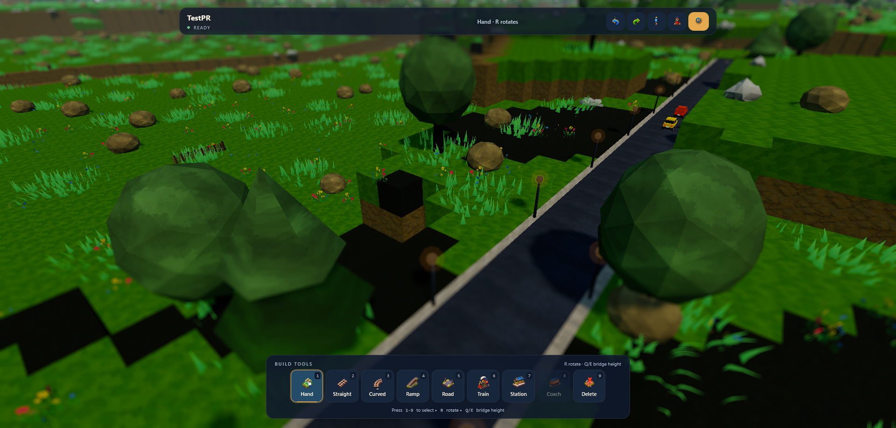
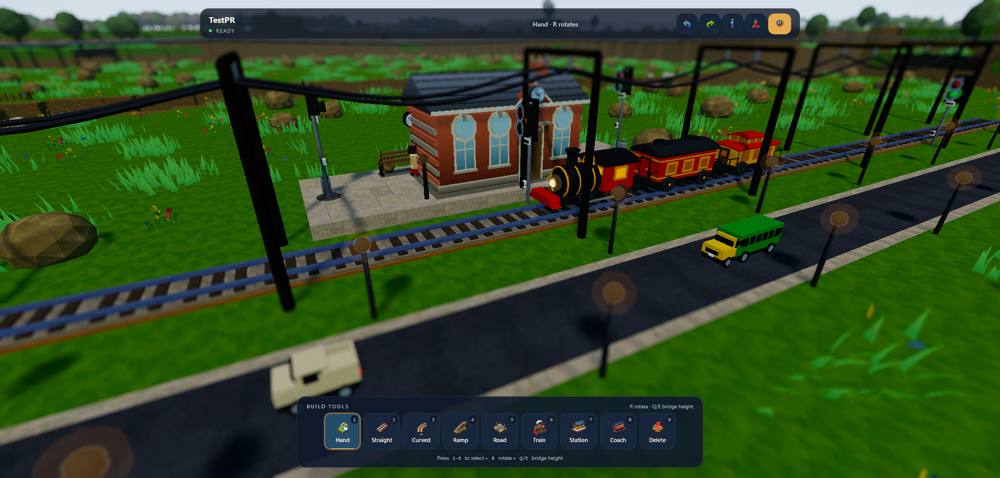

<p align="center">
  
</p>

<h1 align="center">MyTrainWorld</h1>

<p align="center">A stylized railway sandbox built with React, Three.js, React Three Fiber, and Tauri.</p>

<p align="center">
  <a href="https://mytrain.world"></a>
  <a href="https://react.dev/"></a>
  <a href="https://threejs.org/"></a>
  <a href="https://tauri.app/"></a>
  <a href="https://vite.dev/"></a>
  
</p>

<p align="center">
  
  
</p>

## Overview

🎮 **Play Online**: [mytrain.world](https://mytrain.world)

MyTrainWorld lets players generate voxel landscapes, build connected railways, run trains, decorate worlds, and manage saved railways through a desktop-focused interface.

## Features

### Build and decorate

- Seeded voxel terrain with water, meadow, forest, wetland, and highland biomes, including rivers, ponds, terraces, and reserved building clearings.
- Instanced terrain, trees, shrubs, grass and flower patches, rocks, buildings, fences, lamps, and other scenery keep large worlds practical to render.
- Grid-snapped straight, curved, and 45° ramp tracks with validation ghosts, bridges, trestles, endpoint auto-connection, and camera collision handling.
- Two-marker stations with configurable roles: Village, City, Farm, Mine, Factory, Port, Fuel Depot, and Scenic Stop. Stations bind to nearby tracks and reveal their decorated platforms as they are built.
- Seeded scenery roads plus axis-aligned user roads, road lamps and signs, decorative traffic, pedestrians, and animated road-rail crossings.

### Run trains

- Four engine types: steam, diesel, electric, and checker.
- Six coach types: passenger, coal cart, gas tanker, goods, container, and viewdeck.
- Trains traverse connected track graphs with per-train speed controls, start/stop, reversing, station dwell behavior, coach coupling and removal, consist highlighting, focus, and follow camera.
- Engine-specific headlights, smoke, sounds, and procedural coach and engine models provide visual and audio differences without an economy or progression system.
- Overhead electrification gantries and contact wires are generated from connected track chains.

### Shape and save worlds

- Day, dawn, dusk, and night presets with fog and density controls, realtime shadow modes, animated water, skyboxes, wind, fireflies, and stylized lighting.
- Optional miniature tilt-shift and cel-shading post-processing modes.
- Low, medium, high, and custom graphics quality tiers with resolution, shadow, foliage, water reflection, bloom, cloud, and depth-of-field controls.
- Named local worlds with selectable 100×100, 256×256, or 512×512 terrain, editable seeds, thumbnails, rename, duplicate, delete confirmation, import, and export.
- Versioned `.world` JSON files, local saves, debounced autosaves, fallback recovery snapshots, undo/redo history, and camera commands for resetting the overview or framing the railway.
- Photo mode provides FOV and environment controls and exports PNG captures.

### Interface and audio

- Main menu, gameplay HUD, pause menu, help guide, six-step tutorial, train management drawer, station and engine/coach pickers, selection inspection, and transient status notifications.
- Accessibility settings include UI scale, text size, high contrast, and reduced motion.
- Developer diagnostics include FPS and memory telemetry, technical selection details, axis display, configurable detail and placement, and a copyable local report.
- Lazy Web Audio activates after user interaction and provides separate master, train, ambient, music, tool, station, and crossing buses with positional playback.

## Controls

The hotbar uses six top-level groups. Number keys select a group; number keys inside an open group select its child tool.

| Input | Action |
| --- | --- |
| `1` | Hand / deselect |
| `2` | Open Tracks; inside the group, `1` Straight, `2` Curved, `3` Ramp |
| `3` | Road |
| `4` | Open Trains; inside the group, `1` Engine, `2` Coach |
| `5` | Station |
| `6` | Delete |
| `R` | Rotate placement; change train direction or station orientation when those tools are active |
| `Q` / `E` | Lower or raise track bridge/ramp height |
| `X` | Reset track placement height to ground |
| `W` / `A` / `S` / `D` | Move the camera relative to its view |
| Arrow keys | Rotate the camera in place |
| `Shift` | Sprint camera movement |
| `Space` / `C` | Raise / lower the camera |
| Left mouse drag | Orbit the camera; click to place or select |
| Right mouse drag | Pan the camera |
| Mouse wheel | Zoom |
| `Escape` | Close the active tool group or overlay |
| `F9` | Toggle the diagnostics overlay when developer diagnostics are enabled |

Undo is available from the HUD. Save, recovery, camera framing, and other world actions are available from the pause menu or world browser.

## Development

Requirements: Node.js and npm.

Install dependencies:

```bash
npm install
```

Start the Vite development server:

```bash
npm run dev
```

Open `http://localhost:1420/`.

Build the web assets:

```bash
npm run build
```

Run the Tauri desktop development shell:

```bash
npm run tauri dev
```

## Architecture

- `src/App.jsx` owns application views, managers, world lifecycle, settings, selection, history, save/load, recovery, autosave, and audio preferences.
- `src/GameScene.jsx` composes terrain, camera, environment, tracks, stations, trains, roads, traffic, signals, crossings, ambient activity, and render scheduling.
- `src/terrain.js` generates seeded heightmaps, biomes, rivers, ponds, terraces, and voxel terrain data.
- `src/tracks/` handles track geometry, graph connections, placement validation, rendering, bridges, ramps, and overhead lines.
- `src/trains/` handles engine and coach registries, procedural models, path traversal, train state, rendering, smoke, and train controls.
- `src/stations/` handles station markers, roles, deterministic construction, track binding, and platform rendering.
- `src/environment/` handles roads, traffic, scenery scattering, grass, water, sky, lighting, fog, camera movement, and ambient effects.
- `src/signals/` and `src/crossings/` derive lineside signals and animated road-rail crossings from the active track and road layouts.
- `src/ui/` contains the menus, HUD, settings, tools, pickers, help, tutorial, selection, diagnostics, and accessibility controls.
- `src/utils/worldSave.js`, `src/utils/history.js`, and `src/utils/cameraBus.js` provide persistence, reversible edits, recovery, and camera commands.
- `src/render/` and `src/postprocessing/` provide graphics quality tiers, style materials, render scheduling, tilt-shift, cel shading, and final color grading.
- `src/audio/trainAudio.js` provides lazy Web Audio buses and positional playback.

## Project Status

The core creative railway sandbox is playable and remains under active development. Desktop keyboard and mouse controls are required for full play. Mobile and touch devices receive access guidance and a landscape check, but touch play is not supported.

## Story Time

I made this game because I wanted to play it. I was looking for a train game where I could simply place tracks and put a train on it and watch it move along. I wanted something without any progression system or an economy system. A plain zen mode game. But I could not find any. Maybe I am growing old and my searching skills are getting rusty. 

In any case, I made this game after that and had very fun. This game is in no way complete at the moment but fully playable none the less. I hope you have fun playing it too. Made with <3

## Plans
- [ ] More biomes and terrain types
- [ ] Change all textures and icons to hand drawn ones. (I recently got a drawing tab as a gift. I'd like to draw the textures and give this game a hand drawn aesthetic)
- [ ] Controller support
- [ ] Mobile support
- [ ] Multiplayer ?
