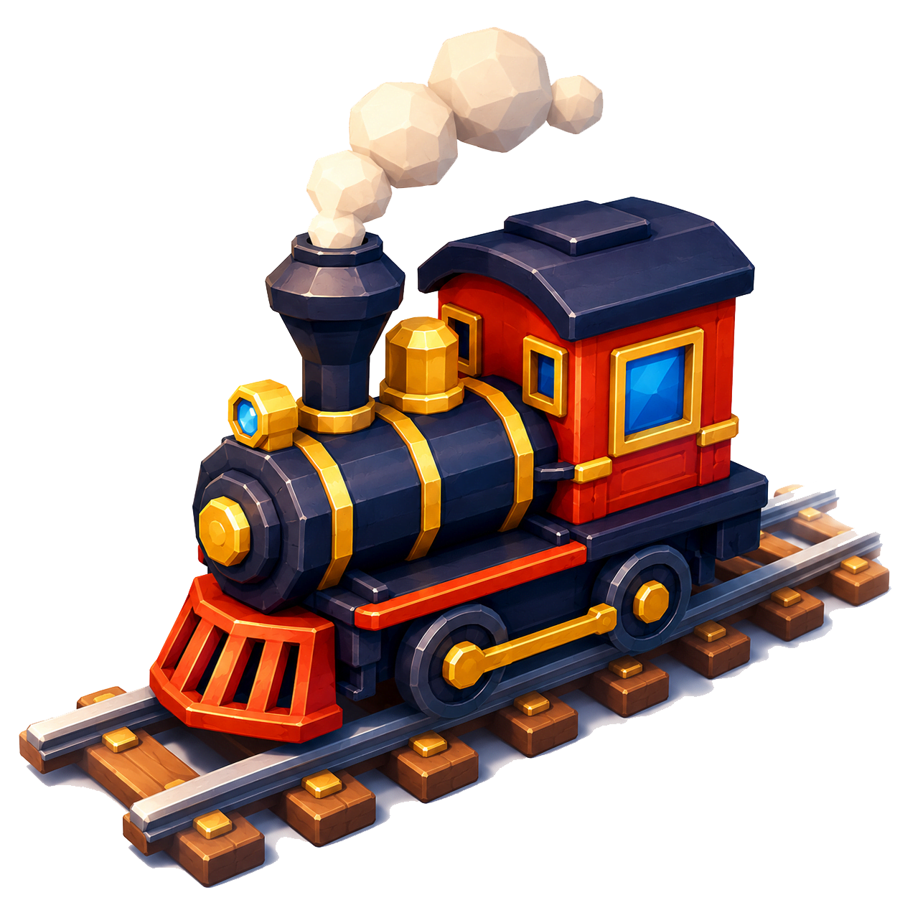

<p align="center">
  
</p>

<h1 align="center">MyTrainWorld</h1>

<p align="center">A stylized railway sandbox built with React, Three.js, React Three Fiber, and Tauri.</p>

<p align="center">
  <a href="https://mytrain.world"></a>
  <a href="https://react.dev/"></a>
  <a href="https://threejs.org/"></a>
  <a href="https://tauri.app/"></a>
  <a href="https://vite.dev/"></a>
  
</p>

<p align="center">
  
  
</p>

## Overview

🎮 **Play Online**: [mytrain.world](https://mytrain.world)

MyTrainWorld lets players generate voxel landscapes, build connected railways, run trains, decorate worlds, and manage saved railways through a desktop-focused interface.

## Features

- Procedural voxel terrain with water, sand, meadow, forest, wetland, and highland biomes.
- Instanced terrain, vegetation, grass patches, props, roads, traffic, and ambient activity.
- Straight, curved, and elevated ramp tracks with grid snapping, ghosts, validation, bridges, and automatic endpoint connections.
- Stations with roles, decorated platforms, track binding, and animated construction reveals.
- Four engine types: steam, diesel, electric, and checker.
- Six coach types with coupling, uncoupling, consist highlighting, route traversal, reversing, stops, and follow camera.
- Automatic signals, road traffic, pedestrians, and animated rail crossings.
- Day, dusk, dawn, and night lighting with fog, water shaders, wind, fireflies, miniature mode, and cel shading.
- World browser with local worlds, thumbnails, rename, duplicate, delete confirmation, import, and export.
- Undo/redo, autosave recovery, versioned JSON world files, and camera framing commands.
- Positional train, station, crossing, tool, biome, ambient, and rotating music audio.
- Desktop keyboard and mouse controls with mobile/touch access warning and landscape requirement.

## Controls

| Input | Action |
| --- | --- |
| `1`-`9` | Select Hand, Straight, Curved, Ramp, Road, Train, Station, Coach, or Delete tool |
| `R` | Rotate or flip placement |
| `Q` / `E` | Lower or raise bridge/ramp height |
| `X` | Reset placement height to ground |
| `Escape` | Deselect tool, close menus, or resume from pause |
| `WASD` | Move camera relative to view |
| `Shift` | Sprint camera movement |
| `Space` / `C` | Raise / lower camera |
| Left mouse | Rotate camera or interact with world |
| Right mouse | Pan camera |
| Mouse wheel | Zoom |
| `F9` | Toggle diagnostics overlay |

## Development

Requirements: Node.js and npm.

```bash
npm install
npm run dev
```

Open `http://localhost:1420/`.

Build web assets:

```bash
npm run build
```

Run Tauri desktop development mode:

```bash
npm run tauri dev
```

## Architecture

- `src/App.jsx` owns managers, world lifecycle, settings, selection, history, save/load, and autosave.
- `src/GameScene.jsx` composes terrain, environment, tracks, stations, trains, roads, traffic, signals, crossings, and camera systems.
- `src/tracks/` handles track geometry, graph management, placement, rendering, and overhead lines.
- `src/trains/` handles engines, coaches, traversal, rendering, smoke, and train controls.
- `src/stations/` handles station validation, roles, construction, and rendering.
- `src/environment/` handles terrain-adjacent scenery, lighting, roads, traffic, grass, water, and ambient activity.
- `src/ui/` contains menus, HUD, settings, tools, selection, help, notifications, and accessibility gates.
- `src/utils/worldSave.js` handles world serialization, local storage metadata, autosaves, recovery, and file import/export.
- `src/audio/trainAudio.js` provides lazy Web Audio buses and positional playback.

## Project Status

Core sandbox systems are playable. Project remains under active development. Mobile touch play is unsupported beyond access guidance; keyboard and mouse remain required for full controls.

## Story Time

I made this game because I wanted to play it. I was looking for a train game where I could simply place tracks and put a train on it and watch it move along. I wanted something without any progression system or an economy system. A plain zen mode game. But I could not find any. Maybe I am growing old and my searching skills are getting rusty. 

In any case, I made this game after that and had very fun. This game is in no way complete at the moment but fully playable none the less. I hope you have fun playing it too. Made with <3

## Plans
- [ ] More biomes and terrain types
- [ ] Change all textures and icons to hand drawn ones. (I recently got a drawing tab as a gift. I'd like to draw the textures and give this game a hand drawn aesthetic)
- [ ] Controller support
- [ ] Mobile support
- [ ] Multiplayer ?
